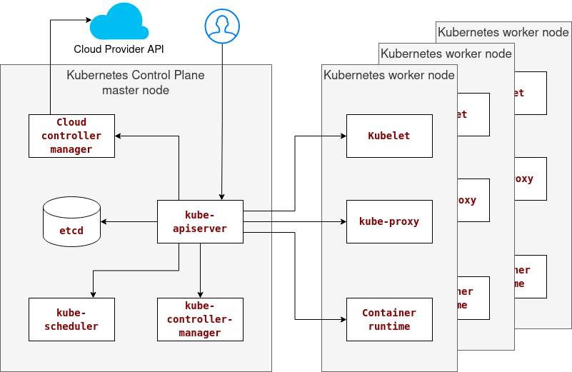

# Kubernetes

## Getting started

* [Kubernetes Tools](https://kubernetes.io/docs/tasks/tools/)
* [Minikube getting started](https://minikube.sigs.k8s.io/docs/start/)

## Reference
* [kubectl Cheat Sheet](https://kubernetes.io/docs/reference/kubectl/cheatsheet/)
* [https://kubernetes.io/](https://kubernetes.io/)

## In-class demos

* [Introduction to Kubernetes](intro/Intro.md)
* [Kubernetes Workloads](workloads/Workloads.md)

## What is Kubernetes?

> Kubernetes is a portable, extensible, open-source platform for managing containerized workloads and services that facilitate declarative configuration and automation. It has a large, rapidly growing ecosystem. Kubernetes services, support, and tools are widely available.1

See [What is Kubernetes?](https://kubernetes.io/docs/concepts/overview/what-is-kubernetes/) for more.

## History of Kubernetes

* Around 2003-2004, Kubernetes began as a small-scale project known as the [Borg System](https://ai.google/research/pubs/pub43438) in collaboration with a new version of Google's new search engine. Borg was a large-scale internal cluster management system that ran hundreds of thousands of jobs, from many thousands of different applications, across many clusters, each with tens of thousands of machines.

* In 2013, Google [introduced the Omega cluster management system](https://cloudplatform.googleblog.com/2014/06/an-update-on-container-support-on-google-cloud-platform.html), a flexible, scalable scheduler for large compute clusters. 

* In 2014, Google introduced Kubernetes as an [open source version of Borg](https://www.youtube.com/watch?v=0W49z8hVn0k)

* On July 21, 2015, [Kubernetes v1.0](https://github.com/kubernetes/kubernetes) is released, and Google partners with the Linux Foundation to form the [Cloud Native Computing Foundation (CNCF)](https://www.cncf.io/). The CNFC aims to build sustainable ecosystems and foster a community around a constellation of high-quality projects that orchestrate containers as part of a microservices architecture.

* In February of 2016, [Helm](https://helm.sh/) was released to make deploying and managing large-scale applications easier.

For more, see:
* [The History of Kubernetes on a Timeline](https://blog.risingstack.com/the-history-of-kubernetes/)
* Kubernetes [release timeline](https://en.wikipedia.org/wiki/Kubernetes#Release_timeline) on Wikipedia.
* [The History of Kubernetes & the Community Behind It](https://kubernetes.io/blog/2018/07/20/the-history-of-kubernetes-the-community-behind-it/)

## Benefits of using Kubernetes

Kubernetes provides you with:1

* __Service discovery and load balancing.__ Kubernetes can expose a container using the DNS name or their IP address. Then, if traffic to a container is high, Kubernetes can load balance and distribute the network traffic to stabilize the workload.
* __Storage orchestration.__ Kubernetes allows you to automatically mount a storage system of your choice, such as local storage, public cloud providers, and more.
* __Automated rollouts and rollbacks.__ You can describe the desired state for your deployed containers using Kubernetes, and it can change the actual state to the desired state at a controlled rate. For example, you can automate Kubernetes to create new containers for your deployment, remove existing containers and adopt all their resources to the new container.
* __Automatic bin packing.__ You provide Kubernetes with a cluster of nodes that it can use to run containerized tasks. Then, you tell Kubernetes how much CPU and memory (RAM) each container needs. By doing so, Kubernetes can fit containers onto your nodes to make the best use of your resources.
* __Self-healing.__ Kubernetes restarts containers that fail, replaces containers, kills containers that don't respond to your user-defined health check, and doesn't advertise them to clients until they are ready to serve.
* __Secret and configuration management.__ Kubernetes lets you store and manage sensitive information, such as passwords, OAuth tokens, and SSH keys. You can deploy and update secrets and application configuration without rebuilding your container images and exposing secrets in your stack configuration.

## Kubernetes Architecture

See [Cluster Architecture](https://kubernetes.io/docs/concepts/architecture/) for more.

## Node types

Kubernetes runs your workload by placing containers into Pods to run on [Nodes](https://kubernetes.io/docs/concepts/architecture/nodes/). Depending on the cluster, a node may be a virtual or physical machine. The control plane manages each node and contains the services necessary to run Pods.

Typically, you have several nodes in a cluster, but you might have only one node in a learning or resource-limited environment.

### Control plane master node

The control plane manages the worker nodes and the Pods in the cluster. The control plane usually runs across multiple computers in production environments, and a cluster usually runs many nodes, providing fault tolerance and high availability.

Any machine in the cluster can run control plane components. However, for simplicity, set up scripts typically start all control plane components on the same machine and do not run user containers on this machine. 

The control plane's components make global decisions about the cluster (for example, scheduling) and detect and respond to cluster events (for example, starting up a new pod when a deployment's replicas field is unsatisfied).

### Worker nodes

A Kubernetes cluster consists of worker machines, called nodes, that run containerized applications. Every cluster has at least one worker node which hosts the Pods that are the components of the application workload.

## kube-apiserver

The kube-apiserver is the component of the Kubernetes control plane that exposes the Kubernetes API. The [REST API](https://kubernetes.io/docs/reference/using-api/) is the fundamental fabric of Kubernetes. All operations and communications between components and external user commands are REST API calls that the API Server handles. Consequently, everything in the Kubernetes platform is treated as an API object and has a corresponding entry in the API.

The [Kubernetes API server](https://kubernetes.io/docs/reference/command-line-tools-reference/kube-apiserver/) validates and configures data for the API objects, which include pods, services, replication controllers, and others. In addition, the API Server handles REST operations and provides the frontend to the cluster's shared state through which all other components interact.

Kubernetes has a "hub-and-spoke" API pattern. All API usage from nodes (or the pods they run) terminates at the apiserver. None of the other control plane components expose remote services. The API server listens for remote connections on a secure HTTPS port (typically 443) with one or more forms of client authentication enabled. See [Control Plane-Node Communication](https://kubernetes.io/docs/concepts/architecture/control-plane-node-communication/) for more.

## etcd

[etcd](https://etcd.io/) is a consistent distributed key-value store. It is mainly used as a separate coordination service in distributed systems like Kubernetes, where it is a backing store for all cluster data. 

## kube-scheduler

The kube-scheduler is the control plane component that watches for newly created Pods with no assigned node, and selects a node for them to run on. When making scheduling decisions, kube-scheduler takes into account include:
* Individual and collective resource requirements.
* Hardware/software/policy constraints.
* Affinity and anti-affinity specifications.
* Data locality.
* Inter-workload interference.
* Deadlines.

## kube-controller-manager

The kube-controller-manager is the control plane component that runs [controller](https://kubernetes.io/docs/concepts/architecture/controller/) processes. Logically, each controller is a separate process, but they are all compiled into a single binary and run in a single process to reduce complexity.

Some types of these controllers are:

* Node controller: Responsible for noticing and responding when nodes go down.
* Job controller: Watches for Job objects that represent one-off tasks, then creates Pods to run those tasks to completion.
* Endpoints controller: Populates the Endpoints object by joining Services and Pods.
* Service Account & Token controllers: Create default accounts and API access tokens for new namespaces.

## Cloud Controller manager

The [cloud-controller-manager](https://kubernetes.io/docs/concepts/architecture/cloud-controller/) is a Kubernetes control plane component that embeds cloud-specific control logic and lets you link your cluster into your cloud provider's API and separates the components that interact with that cloud platform from components that only interact with your cluster.

## Kubelet

Kubelet is an agent that runs on each node in the cluster. It makes sure that containers are running in a Pod. It takes a set of PodSpecs provided through various mechanisms and ensures that the containers described in those PodSpecs are running and healthy. The kubelet doesn't manage containers which Kubernetes did not create.

## Kube-proxy

kube-proxy is a network proxy that runs on each node in your cluster, implementing part of the Kubernetes Service concept. It maintains network rules on nodes that allow communication to your Pods from network sessions inside or outside your cluster.

kube-proxy uses the operating system packet filtering layer if there is one and it's available. Otherwise, kube-proxy forwards the traffic itself.

## Container runtime

The [Container Runtime Interface (CRI)](https://kubernetes.io/docs/concepts/architecture/cri/) is a plugin interface that enables the kubelet to use a wide variety of container runtimes, without needing to recompile the cluster components.

To launch Pods and their containers, you need a working container runtime on each Node in your cluster. The CRI is the primary protocol for the communication between the kubelet and Container Runtime.

The Kubernetes Container Runtime Interface (CRI) defines the main [gRPC](https://grpc.io/) protocol for the communication between the cluster components kubelet and container runtime.

## References:
1. [What is Kubernetes?](https://kubernetes.io/docs/concepts/overview/what-is-kubernetes/)