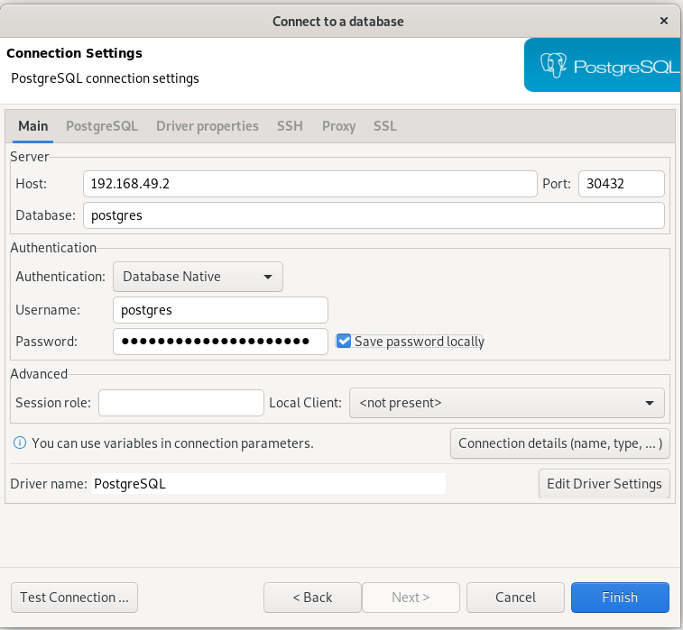

# More on Storage

## PersistentVolume

* [Kubernetes.io Persistent Volumes](https://kubernetes.io/docs/concepts/storage/persistent-volumes/)
* [Minikube Persistent Volumes](https://minikube.sigs.k8s.io/docs/handbook/persistent_volumes/)
* [Create a PersistentVolume](https://kubernetes.io/docs/tasks/configure-pod-container/configure-persistent-volume-storage/#create-a-persistentvolume)


Apply [pvol000-pv.yaml](./pvol000-pv.yaml):
```
kubectl apply -f pvol000-pv.yaml
kubectl describe persistentvolume/pvol000
```

## PersistentVolumeClaim

* [PersistentVolumeClaims](https://kubernetes.io/docs/concepts/storage/persistent-volumes/#persistentvolumeclaims)
* [Create a PersistentVolumeClaim](https://kubernetes.io/docs/tasks/configure-pod-container/configure-persistent-volume-storage/#create-a-persistentvolume)

Apply [pvol000-pv-claim.yaml](pvol000-pv-claim.yaml):
```
kubectl apply -f pvol000-pv-claim.yaml
kubectl describe persistentvolumeclaim/pvol000-pv-claim
```

## Using a PersistentVolumeClaim

* [Claims As Volumes](https://kubernetes.io/docs/concepts/storage/persistent-volumes/#claims-as-volumes)


Apply [postgres-deployment.yaml](postgres-deployment.yaml):
```
kubectl apply -f postgres-deployment.yaml
kubectl get pvc,pv,pods,svc,deployment
kubectl describe deployment.apps/postgres
kubectl describe service/postgres
minikube service list
```

Explore:
* Using a SQL client like [DBeaver](https://dbeaver.io/download/), connect to the database using the password "Use-a-Better-Passw0rd" along with the IP address and port number from the service list above:



* Verify this query `select * from products;` fails with a products table does not exist error.
* Run this script in a new SQL Editor:
  ```
  drop table if exists products;

  CREATE TABLE products (
      product_no integer,
      name text,
      price numeric
  );

  INSERT INTO products (product_no, name, price) VALUES
      (1, 'Cheese', 9.99),
      (2, 'Bread', 1.99),
      (3, 'Milk', 2.99);
  ```
* Verify the table has data: `select * from products;`
* Disconnect from the database
* Scale down to zero to kill the pod: 
  ```
  kubectl scale deployment.apps/postgres --replicas=0
  kubectl get all --show-labels
  ```

* Scale back to 1 instance:
  ```
  kubectl scale deployment.apps/postgres --replicas=1
  kubectl get all --show-labels
  ```

* In DBeaver, reconnect to the database
* Verify the table still exisits and has data: `select * from products;`
* Quit DBeaver

## Clean up

```
kubectl get pvc,pv,pods,svc,deployment
kubectl delete deployment.apps/postgres service/postgres
kubectl get pvc,pv,pods,svc,deployment
kubectl delete persistentvolumeclaim/pvol000-pv-claim
kubectl get pvc,pv,pods,svc,deployment
kubectl delete persistentvolume/pvol000
```
