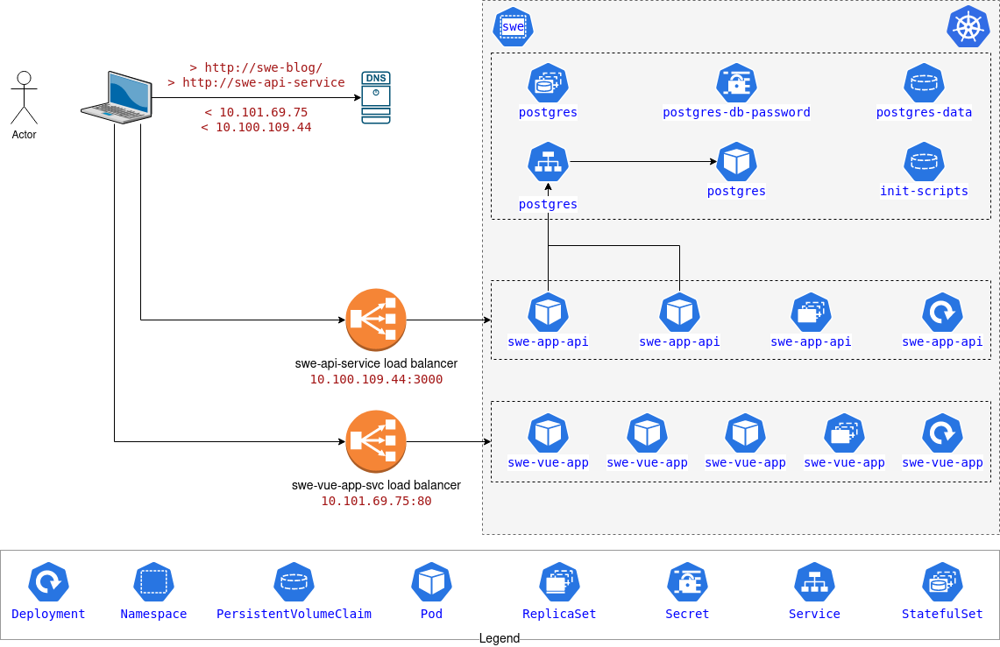

# Deploy a complex app:

Deploy the API and front end website from [Spring Web Essentials](https://leanpub.com/springwebessentials).

[](https://leanpub.com/springwebessentials)

## Architecture Overview



## Give it a unique namespace:

Apply [swe-ns.yaml](./swe-ns.yaml): 
```
kubectl apply -f swe-ns.yaml
```

Make it the default for our current context:
```
kubectl config set-context --current --namespace=swe
```

## Create a secret for the database and API to use:

Apply [postgres-db-password-secret.yaml](postgres-db-password-secret.yaml): 
```
kubectl apply -f postgres-db-password-secret.yaml
```

**NOTE:** While the password may look encrypted, it is only encoded and easily be decoded. DO NOT check passwords and other secrets into version control unless it's private and access is extremely limited. 

```
echo VXNlLWEtQmV0dGVyLVBhc3N3MHJk | base64 --decode
```

## Deploy a PostgreSQL StatefulSet for the API to use:

* [StatefulSets](https://kubernetes.io/docs/concepts/workloads/controllers/statefulset/)

Apply [postgres-sts.yaml](postgres-sts.yaml): 
```
kubectl apply -f postgres-sts.yaml
minikube service list
```
Notes:
* The use of an [InitContainer](https://kubernetes.io/docs/concepts/workloads/pods/init-containers/) to prepopulate the database with example content for the application.
* The `volumeClaimTemplates` will provide stable storage using PersistentVolumes provisioned by a [PersistentVolume](https://kubernetes.io/docs/concepts/storage/persistent-volumes/) Provisioner.

## Deploy an API that uses the database:

Apply [swe-app-api-deploy.yaml](swe-app-api-deploy.yaml): 
```
kubectl apply -f swe-app-api-deploy.yaml
```

## Create a service so clients can connect:

Apply [swe-app-api-svc.yaml](./swe-app-api-svc.yaml): 
```
kubectl apply -f swe-app-api-svc.yaml
```

**NOTE:** Run `minikube tunnel` in a second terminal window and provide your password when prompted.

Finding the service IP address:

```
minikube service list
minikube service --url swe-api-service -n swe
curl `minikube service --url swe-api-service -n swe`/api/authors
kubectl get services swe-api-service -n swe
curl <EXTERNAL-IP>:3000/api/authors
```

## Deploy the front end single page application:

Apply [swe-vue-app-deploy.yaml](./swe-vue-app-deploy.yaml):
```
kubectl apply -f swe-vue-app-deploy.yaml
kubectl get all -n swe
```

## Expose it via a service

Apply [swe-vue-app-svc.yaml](swe-vue-app-svc.yaml)

```
kubectl apply -f swe-vue-app-svc.yaml
kubectl get all -n swe
```
__NOTE:__ If service/swe-vue-app-svc has a `<pending>` external IP address for more than 1 minute, go to the terminal running `minikube tunnel`, press `<Ctrl>+C` to exit the tunnel, then rerun `minikube tunnel`.

Explore:
* Open the browser and point at the external IP address for the `swe-vue-app-svc` service
* Use the dev tools and inspect the network activity
* Create a DNS entry in `/etc/hosts` with external IP address for `swe-api-service` and a hostname of `swe-api-service`
* Refresh the page and notice the change in the network stats
* Check the console for errors
* Create a DNS entry in `/etc/hosts` with external IP address for `swe-vue-app-svc` and a hostname of `swe-blog`
* Point your browser at `http://swe-blog/` and check the network and console

## Clean up:

```
kubectl get all,pv,pvc,secrets -n swe

kubectl delete service/swe-vue-app-svc service/swe-api-service service/postgres -n swe
kubectl delete deployment.apps/swe-vue-app deployment.apps/swe-app-api -n swe
kubectl delete statefulset.apps/postgres -n swe
kubectl delete persistentvolumeclaim/postgres-data-postgres-0 secret/postgres-db-password -n swe

kubectl get all,pv,pvc,secrets -n swe
```